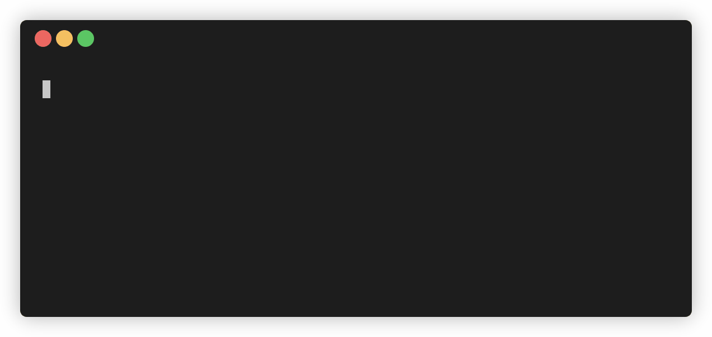

# Stopwatch
> simple terminal stopwatch

## Dependencies

- Node.js v17 and above

## Usage

Start the program with:

```
$ npm start
```

Press enter or spacebar to start the timer and press again to stop. Repeat to record multiple segments. Press Ctrl-c to exit.

The keyboard bindings which trigger starting and stopping the stopwatch can be changed by providing the `TRIGGER_KEYS` argument with the desired keys as a comma separated list:

```
$ TRIGGER_KEYS=space,w,a,s,d npm start
$ TRIGGER_KEYS="escape, delete" npm start
```

Note: the enter key can not be unbound as a trigger key because `readline.question` binds to it. The only way to disable this is to not use that method, which may be possible if this behavior is a problem.

## Demo



## Notes

This was made for fun and to learn something new. This project introduced me to the [Readline](https://nodejs.org/api/readline.html) and [AbortController](https://developer.mozilla.org/en-US/docs/Web/API/AbortController) APIs, which I had no prior experience with before this project. Pull requests are welcome!